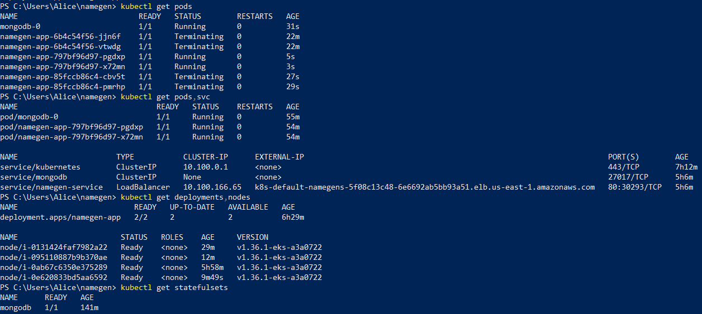
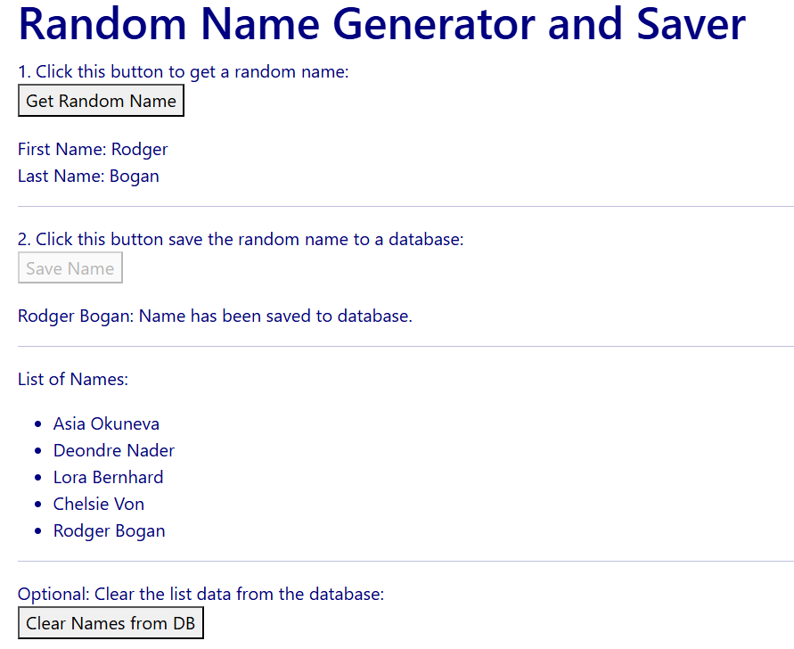

# Namegen DevOps Deployment on AWS EKS

This repository contains the source code, Docker configuration, Kubernetes manifests, and CI/CD automation for deploying the \
amegen\ web application on AWS Elastic Kubernetes Service (EKS) with persistent MongoDB storage.

---

## ??? Architecture Overview

The application is deployed on an AWS EKS cluster with managed node groups. External HTTP traffic routes through an AWS Elastic Load Balancer to the Node.js frontend pods, which communicate internally with a MongoDB StatefulSet backed by AWS EBS persistent storage (gp3).

---

## ?? Repository Structure

\\\
.
+-- server.js                   # Application entry point
+-- package.json                # Node.js dependencies
+-- Dockerfile                  # Container build instructions
+-- architecture-diagram.png    # Architecture & CI/CD Diagram
+-- eksctl/
¦   L-- cluster.yaml            # EKS Cluster provision configuration
+-- k8s/
¦   +-- app-deployment.yaml     # App Deployment
¦   +-- app-service.yaml        # LoadBalancer Service
¦   L-- mongodb-statefulset.yaml# MongoDB StatefulSet & Service
L-- screenshots/
    +-- app-cleared-db.png
    +-- app-saved-names.png
    L-- kubectl-cluster-status.png
\\\

---

## ?? CI/CD Pipeline & Deployment Instructions

### 1. Provision AWS EKS Cluster
\\\ash
eksctl create cluster -f eksctl/cluster.yaml
\\\

### 2. Deploy Kubernetes Resources
\\\ash
kubectl apply -f k8s/
\\\

### 3. Verify Deployment
\\\ash
kubectl get pods,svc,deployments,statefulsets
\\\

---

## ?? Screenshots

### Active Kubernetes Cluster Resources

### Running Application & MongoDB Persistence

