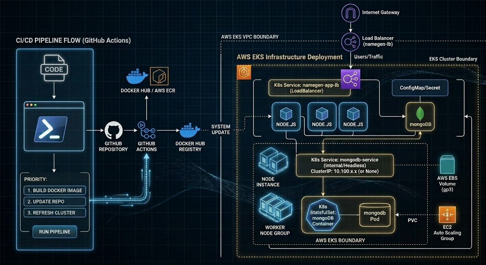
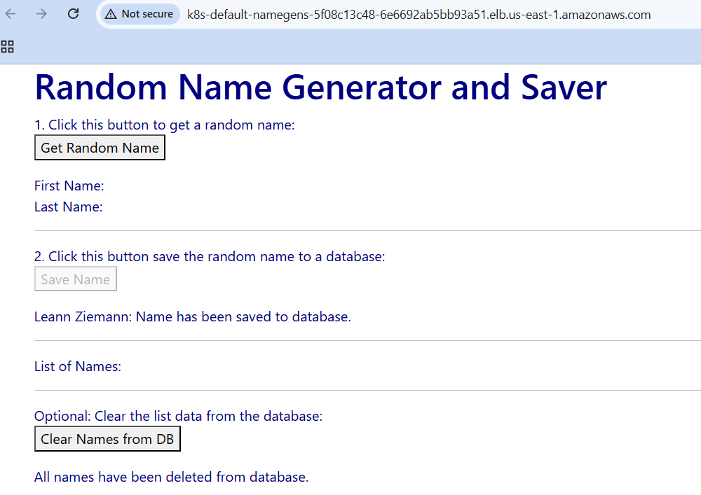

# Namegen - Cloud Native DevOps Deployment on AWS EKS


This repository contains the complete DevOps deployment pipeline for **Namegen**, a Node.js web application running on **AWS Elastic Kubernetes Service (EKS)** backed by a persistent **MongoDB StatefulSet**.

---

## 🛠️ Applications & Technologies Used

* **Cloud Infrastructure:** Amazon Web Services (AWS EKS, EC2, EBS gp3, Elastic Load Balancer)
* **Containerization & Orchestration:** Docker, Kubernetes (`kubectl`), `eksctl`
* **Application Framework:** Node.js, Express, JavaScript
* **Database & Persistence:** MongoDB, Kubernetes StatefulSet, PersistentVolumeClaim (PVC)
* **Version Control & CI/CD:** GitHub, GitHub Actions

---

## 🏗️ Architecture Overview

The Node.js frontend pods run inside an AWS EKS managed node group and route external traffic via an AWS Elastic Load Balancer. Application state is persisted using a MongoDB StatefulSet attached to dynamic AWS EBS (`gp3`) volumes.



---

## 🌐 Application Endpoint

* **LoadBalancer External DNS:** `k8s-default-namegens-5f08c13c48-6e6692ab5bb93a51.elb.us-east-1.amazonaws.com`
* **Service Port:** `80:30293/TCP`

---

## 📁 Repository Structure

```
.
├── server.js                   # Node.js application server
├── Dockerfile                  # Container build instructions
├── architecture-diagram.jpg    # AWS Architecture & CI/CD diagram
├── eksctl/
│   └── cluster.yaml            # EKS cluster provision configuration
├── k8s/
│   ├── app-deployment.yaml     # Application deployment manifest
│   ├── app-service.yaml        # LoadBalancer service manifest
│   └── mongodb-statefulset.yaml# MongoDB StatefulSet & Headless Service
└── screenshots/
├── app-cleared-db.png      # Application initial state
├── app-saved-names.png     # Persistent database verification
└── kubectl-cluster-status.png # Active cluster status & resources
```

---
## 🚀 Deployment Instructions

### 1. Provision Cluster
```bash
eksctl create cluster -f eksctl/cluster.yaml
```

### 2. Deploy Kubernetes Resources
```bash
kubectl apply -f k8s/
```

### 3. Verify Deployment
```bash
kubectl get pods,svc,deployments,statefulsets
```
---
## 📷 Screenshots & Verification
### Active Kubernetes Cluster & LoadBalancer Address


### Application Initial State (Cleared Database)


### Saved Names & MongoDB Persistence

